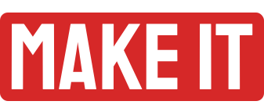
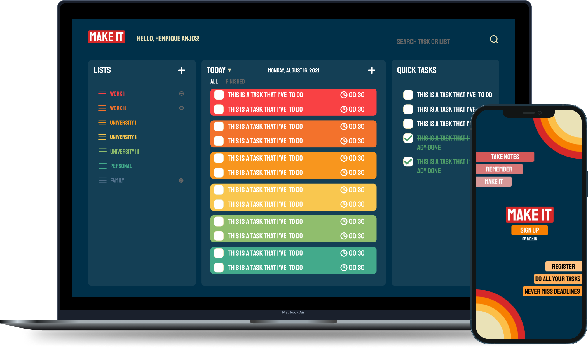

<h1 align="center">
    
</h1>

<h6 align="center"> 
  A new way to make any things you will have to do !
</h6>
<!-- <h5 align="center"> 
 🚧 Project in Development 🚧
</h5> -->

<p align="center">

  

  
	
  
  <a href="https://github.com/henriqueaanjos/makeit/commits/master">
    
  </a>
  

  
   <a href="https://github.com/henriqueaanjos/bethehero/stargazers">
    
  </a>
</p>

<p align="center">
  <a href="#-About-Project">About</a>&nbsp;&nbsp;&nbsp;|&nbsp;&nbsp;&nbsp;
  <a href="#-Layout">Layout</a>&nbsp;&nbsp;&nbsp;|&nbsp;&nbsp;&nbsp;
  <a href="#-Features">Features</a>&nbsp;&nbsp;&nbsp;|&nbsp;&nbsp;&nbsp;
  <a href="#-Technologies">Technologies</a>&nbsp;&nbsp;&nbsp;|&nbsp;&nbsp;&nbsp;
  <a href="#-Requirements">Requirements</a>&nbsp;&nbsp;&nbsp;|&nbsp;&nbsp;&nbsp;  
  <a href="#-Instructions">Instructions</a>&nbsp;&nbsp;&nbsp;|&nbsp;&nbsp;&nbsp;
  <a href="#-License">License</a>
</p>

<p align="center">
    
</p>

## 💻 About Project
  Have you ever forgotten an appointment or task that you were supposed to do? Make It was developed to help you with this. Make It is a Todo List that allows you to:
  - Group tasks by lists,
  - Set task duration time,
  - Separate quick tasks (lasting max 15min) and larger projects.
  - Set activities for today, tomorrow and next week.
  - In addition to enabling search by name of tasks and lists.

## 🎨 Layout
  The complete Layout can be accessed on figma in this link:
  <a href="https://www.figma.com/file/mbtwBPDiowUJaTlt3QzGVL/Makeit?node-id=0%3A1">
    
  </a>
  
## 🛠 Tecnologies

This project was developer with belong tecnologies:

- [Node.js](https://nodejs.org/en/)
- [Prisma](https://knexjs.org)
- [Express](https://expressjs.com)
- [SqLite3](https://www.sqlite.org/index.html)
- [React](https://reactjs.org)
- [Styled-components](https://styled-components.com)
- [Framer Motion](https://www.prisma.io)
- [React Lottie](https://github.com/chenqingspring/react-lottie)
- [Typescript](https://www.typescriptlang.org)
- [React-Native](https://reactnative.dev)
- [Expo](https://expo.dev)

## 🚨 Requirements

To run this project you will need to have the following tools installed on your machine:
- [Node.js](https://nodejs.org/en/)
- [Git](https://git-scm.com)

## 🧭 Instructions
### 🎲 Backend
```bash
# Clone este repositório
$ git clone https://github.com/henriqueaanjos/makeit.git

# Acesse a pasta do projeto no terminal/cmd
$ cd makeit

# Vá para a pasta server
$ cd backend

# Instale as dependências
$ npm install

# Execute a aplicação em modo de desenvolvimento
$ npm run dev

# O servidor inciará na porta:4000 - acesse http://localhost:4000 
```

### 💻 Frontend
```bash
# Clone este repositório
$ git clone https://github.com/henriqueaanjos/makeit.git

# Acesse a pasta do projeto no seu terminal/cmd
$ cd makeIt

# Vá para a pasta da aplicação Front End
$ cd frontend

# Instale as dependências
$ npm install

# Execute a aplicação em modo de desenvolvimento
$ npm run start

# A aplicação será aberta na porta:3000 - acesse http://localhost:3000
```
### 📱Mobile

 🚧 Under development 🚧
 
## 📖 License
This project is under the MIT license. See the <a href="/license">LICENSE</a> file for more details.

---
<p align="center">
  by Henrique Anjos with ❤️
</p>
<p align="center">
  <a href="https://www.linkedin.com/in/henrique-aanjos">
    
  </a>
  <a href="https://www.instagram.com/henriqueaanjos/">
    
  </a>
</p
